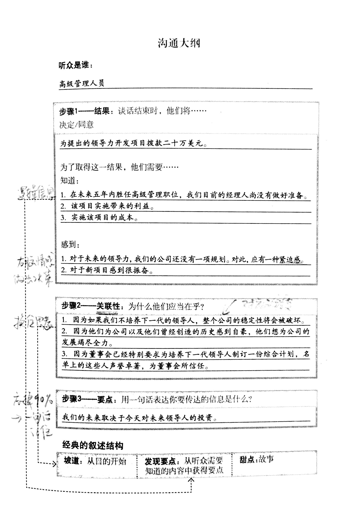

title: 高效演讲Chapter1精心准备
date: 2016-10-30 20:36:11
tags: [演讲, 读书笔记]
---

一个好的演讲一定是经过了精心准备的。也许有些人一大早起来脑子里就有精彩绝伦的句子随时可以进行滔滔不绝的演讲了，但是对于绝大部分的普通人来说，更有效的准备才能取得更好的演讲效果。
<!--more-->

@本篇日志是《高效演讲》（As We Speek）的读书笔记整理 ＃第一章

书中将准备演讲分为了以下三个步骤：
- 结果
- 关联
- 要点

# 结果：带着目标去演讲
确定你想要的结果，你想要获得什么？

首先需要明确的是你想要的结果是什么？如果不明确这一点，你的演讲很可能仅仅是传递了信息，或者会导致你将所有你知道的信息抛向你的听众。

一个有效的演讲可能取得这3种积极的结果：
- 你的听众洞悉了你的观点并且有了**心态的变化**，他体悟到之前未曾体悟到的一些东西。
- 你的听众因为这次对话有了**新的决定**。可能是当场作出的决定，也有可能是对话之后作出。
- 你的听众**采取了行动**。可能是当着你的面确实做了一些事情：签署表格，在支票上签字，说了声“好”。

**而你，想要的是什么呢？把它写下来，一定要具体一些。你的结果应该是可以实现的**。

这就相当于，让听众从A点转移到B点，为了完成这个目标，他们需要像你学习，这些东西就是演讲内容的基础。可以将这些内容想象成结果标题的下拉菜单，为了取得你想要的结果，听众需要了解哪些内容？
你可能会列一个长长的单子，想要告诉他们一系列的事情。但是，如果你严格要求，它们可以被归纳为三件。**三事原则**会确保你远离人们抱怨演讲的第一项：信息量过大。

那么，人们会根据他们了解到的信息进行决策吗？答案是否定的。
根据科学研究结果表明：人们进行决策的时候是由处理故事、情感、色彩以及幽默的右脑作出。
因此，**仅仅向他人提供信息是不够的，因为我们并不是基于逻辑，而是根据感觉作出决策**。
> 逻辑令人思考，情感促人行动。                           －商务咨询专家／作家 艾伦.卫斯

这是演讲的关键部分，也是人们往往忽视的部分。现在，我们应该在结果标题的下拉菜单中增加重要的一项：为了取得你想要的成果，**听众需要感受到什么**？

总结起来，结果部分需要提炼出以下几方面的表述：

>**成果：**谈话时，他们将决定／同意……
>**为了取得这个成果，他们需要知道：**1，……  2，……  3，……
>**感觉到：**1，……  2，……

# 关联性：从听众出发去准备
找出关联性，为什么听众要关注？

很多演讲着都会犯的一个错误就是，没有首先明确听众为什么要重视你说的内容，而是直接向他们传递信息。如果他们不在乎你要说什么，那么也不会有人听你在说什么。
通过问自己几个问题，你就会明白关联性的在讲话中的意义：为什么听众要重视你的话？你的话对他们有什么价值？这样就完成了三件重要的事情：
- 让听众兴趣盎然，全神贯注
- 直接向听众证明你心里装着他们感兴趣的东西
- 避免听众发出“与我无关”的抱怨

给自己三个合理、充分的理由，说明听众为什么要在意你说的内容。
> 关联性：为什么听众应当关注你说的话，你说的话对他们有什么价值？
> 1，…… 2，…… 3，……

# 要点：清晰有力传达要点
要点明确。在令人难忘的语句中，你要传达的信息是什么？

我们通常希望将自己知道的一切都喋喋不休的告诉听众，因此经常没有说清楚要点。
你可能花了几个月的时间精心准备里演讲，可悲的是，尽管你很努力，但晚上，听众的脑袋一碰枕头，就把你说过的90%的内容都忘在脑后了，那么，你想让听众记住的是什么呢？

非常简单，**你的要点就是你要传达的信息，将其用容易记住的一个短语或句子表达出来**。不求悦耳动听，只要清晰即可。运用最直接、最有力的方式来表达它。
> 用一句话阐明你的观点：……

# 例子
假如你是一家大型企业的人力资源部部长。为一个开发项目制定领导力发展计划，你需要高层管理团队批准已制定的预算。如何为你的演讲准备一份大纲，下面为你展示了一个例子：
